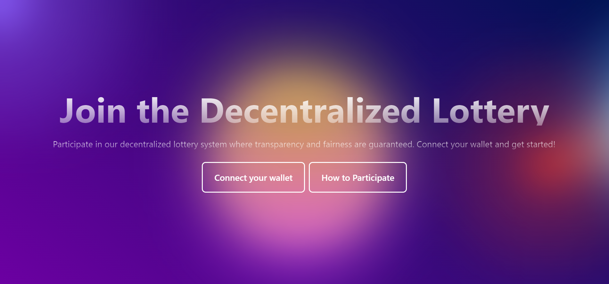
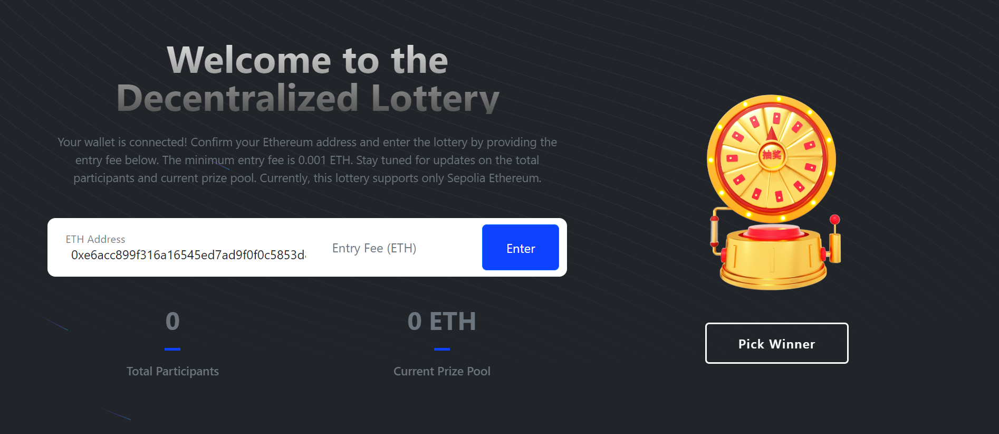

# 🪙 Decentralized Lottery App

Welcome to the Decentralized Lottery App! This project aims to create a transparent, secure, fair lottery system using blockchain technology. By leveraging smart contracts, we ensure the lottery is tamper-proof and the results are verifiable.

## 📸 Preview





## 📑Table of Contents

- [Introduction](#introduction)
- [Features](#features)
- [Installation](#installation)
- [Usage](#usage)
- [Smart Contract Details](#smart-contract-details)
- [Technologies Used](#technologies-used)
- [Contributing](#contributing)
- [License](#license)
- [Contact](#contact)

## Introduction

The Decentralized Lottery App is built on the Ethereum blockchain. It utilizes smart contracts to manage the lottery process, ensuring fairness and transparency. Participants can buy tickets, and a winner is selected randomly through the smart contract.

## Features

- **Decentralized:** Operates on the Ethereum blockchain, removing the need for a central authority.
- **Transparent:** All transactions and processes are recorded on the blockchain, ensuring transparency.
- **Secure:** Utilizes smart contracts to manage the lottery, making it tamper-proof.
- **Fair:** The smart contract handles Random winner selection, ensuring fairness.

## Installation

To run this project locally, follow these steps:

1. **Clone the repository:**

```sh
git clone https://github.com/Jagadeeshftw/Decentralized_Lottery_App.git
cd Decentralized_Lottery_App
```

2. **Install dependencies:**

```sh
 npm install
```

3. **Set Infura API key:**

```sh
npx hardhat vars set INFURA_API_KEY
```

4. **Set Sepolia private key:**

```sh
npx hardhat vars set SEPOLIA_PRIVATE_KEY
```

5. **Compile the smart contracts:**

```sh
npx hardhat compile
```

6. **Test the smart contracts:**

```sh
 npx hardhat test
```

7. **Start a local node & deploy the Hardhat Ignition module in the sepolia network:**

```sh
npx hardhat node
npx hardhat ignition deploy ./ignition/modules/lottery.ts --network sepolia
```

8. **Run the application:**

```sh
npm run dev
```

## 👤 Usage

1. **Buy Tickets:** Participants can buy lottery tickets by sending Ether to the smart contract.
2. **Draw Lottery:** The smart contract will randomly select a winner from the participants.
3. **Claim Winnings:** The winner can claim their winnings by interacting with the smart contract.

## Smart Contract Details

The smart contract is written in Solidity and deployed on the Ethereum network. It manages the following functions:

- \`buyTicket\`: Allows users to buy a lottery ticket.
- \`drawLottery\`: Selects a random winner from the participants.
- \`claimWinnings\`: The winner can claim their prize.

## 🛠️ Technologies Used

- **Solidity:** For writing smart contracts.
- **Hardhat & Truffle:** Development framework for Ethereum.
- **Nextjs:** For building the front-end application.
- **Web3.js & Ethers.js:** For interacting with the Ethereum blockchain.

## 🤝 Contributing

We welcome contributions to this project. If you would like to contribute, please follow these steps:

1. Fork the repository.
2. Create a new branch (\`git checkout -b feature/your-feature\`).
3. Commit your changes (\`git commit -m 'Add some feature'\`).
4. Push to the branch (\`git push origin feature/your-feature\`).
5. Open a pull request.

## 📝 License

This project is licensed under the MIT License. Please have a look at the [LICENSE](LICENSE) file for details.

## 📧 Contact

For any questions or feedback, please reach out to:

- **Helios** - [Jagadeeshftw](https://github.com/Helios9284)
